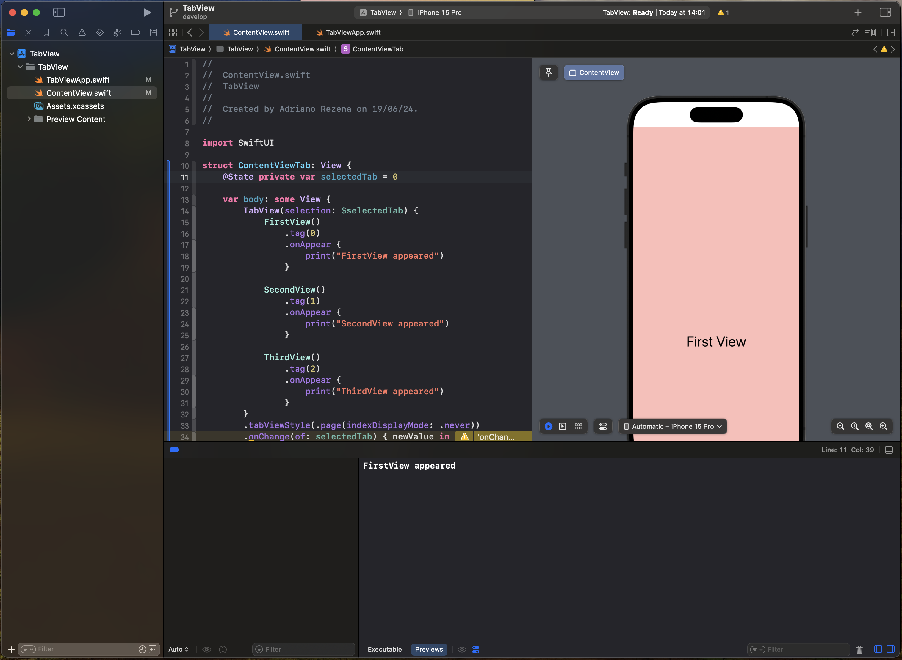
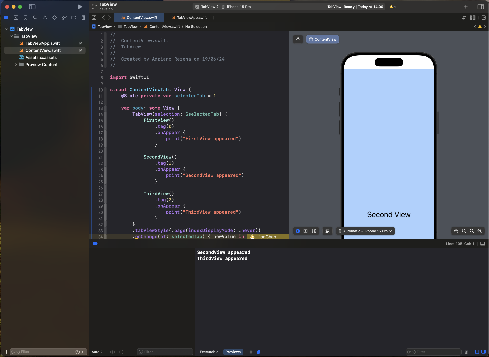

# TabView Test on iOS 18

The purpose of this example is to test TabView on iOS 18 (Xcode 16). 

## Observations
I noticed a strange situation when using TabView initially pointing to a tab that is not the first one. If the selected screen has a vertical scroll, scrolling vertically also triggers the onAppear of the next tab.
This already happens with iOS 17 and Xcode 15. I tested it on the new one to see if this would no longer happen.

If the `selectedTab` is `0`, only the `onAppear` of the first view will be executed.

If the `selectedTab` is `1`, the `onAppear` of the second and third views will be executed.

**© Adriano Cosme Rezena | 2024**